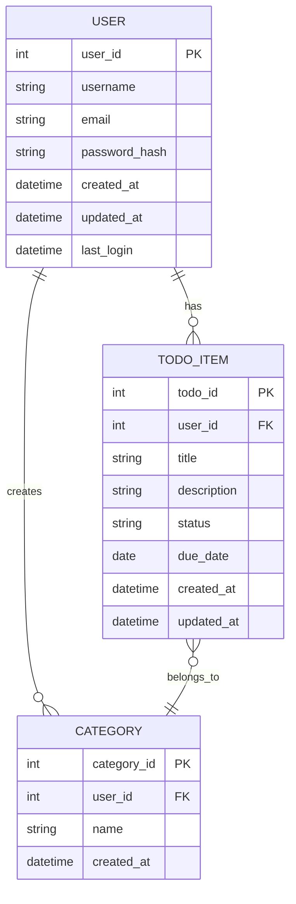

# Todo App Database Requirements

Creating a Todo app involves several considerations regarding the database design and requirements. A well-structured database is crucial for efficient data management, retrieval, and overall application performance. Below are the key requirements and considerations for a Todo app database, with a focus on authenticated users.

## 1. Data Model

### 1.1 Entities
The primary entities in a Todo app typically include:

- **User**: Represents the individual using the app, requiring authentication.
- **Todo Item**: Represents a task or item that the user needs to complete.
- **Category**: (Optional) Represents different categories or tags for organizing Todo items.

### 1.2 Relationships
- A **User** can have multiple **Todo Items**.
- A **Todo Item** can belong to one **User**.
- A **Todo Item** can optionally belong to one **Category**.

### 1.3 Database Structure Visualization
To better understand the relationships and structure of the database, the following Mermaid diagram illustrates the connections between the entities:

## 2. Attributes

### 2.1 User Table
- **user_id** (Primary Key): Unique identifier for each user.
- **username**: Unique username for the user.
- **email**: User's email address, which must be unique.
- **password_hash**: Hashed password for secure authentication.
- **created_at**: Timestamp of when the user was created.
- **updated_at**: Timestamp of the last update to the user profile.
- **last_login**: Timestamp of the user's last login for tracking user activity.

### 2.2 Todo Item Table
- **todo_id** (Primary Key): Unique identifier for each Todo item.
- **user_id** (Foreign Key): Identifier linking to the User table.
- **title**: Title of the Todo item, which must be non-empty.
- **description**: Detailed description of the Todo item (optional).
- **status**: Current status (e.g., pending, completed, archived).
- **due_date**: Date by which the Todo item should be completed (optional).
- **created_at**: Timestamp of when the Todo item was created.
- **updated_at**: Timestamp of the last update to the Todo item.

### 2.3 Category Table (Optional)
- **category_id** (Primary Key): Unique identifier for each category.
- **user_id** (Foreign Key): Identifier linking to the User table.
- **name**: Name of the category, which must be unique for each user.
- **created_at**: Timestamp of when the category was created.

## 3. Functional Requirements

### 3.1 CRUD Operations
The database should support the following operations for each entity:

- **Create**: Add new users, Todo items, and categories.
- **Read**: Retrieve user information, Todo items, and categories.
- **Update**: Modify existing user profiles, Todo items, and categories.
- **Delete**: Remove users, Todo items, and categories.

### 3.2 User Authentication
- The database must securely store user credentials and support authentication mechanisms, including:
  - Password hashing (e.g., bcrypt) to protect user passwords.
  - Token-based authentication (e.g., JWT) for session management.
  - Email verification to ensure valid user accounts.

### 3.3 User Data Management
- Users should be able to update their profiles, including changing their passwords and email addresses.
- Implement functionality to allow users to reset their passwords securely.

### 3.4 Data Integrity
- Ensure referential integrity between tables (e.g., a Todo item must reference a valid user).
- Implement constraints to prevent invalid data entries (e.g., non-empty titles for Todo items).

## 4. Non-Functional Requirements

### 4.1 Performance
- The database should be optimized for fast read and write operations, especially as the number of users and Todo items grows.

### 4.2 Scalability
- The database design should allow for easy scaling, whether vertically (upgrading hardware) or horizontally (adding more servers).

### 4.3 Security
- Implement measures to protect sensitive user data, such as encryption for passwords and secure access controls.
- Regularly update security protocols to safeguard against vulnerabilities.

### 4.4 Backup and Recovery
- Regular backups should be scheduled to prevent data loss, and a recovery plan should be in place.

## 5. Technology Stack

### 5.1 Database Management System (DBMS)
- Choose a suitable DBMS based on the app's requirements. Common choices include:
  - **Relational Databases**: MySQL, PostgreSQL
  - **NoSQL Databases**: MongoDB, Firebase Firestore

### 5.2 ORM (Object-Relational Mapping)
- Consider using an ORM for easier database interactions, such as Sequelize (for Node.js) or Entity Framework (for .NET).

## Conclusion

Designing a database for a Todo app requires careful consideration of the data model, relationships, and functional requirements, particularly for authenticated users. By adhering to these requirements and utilizing the provided diagram, developers can create a robust and efficient database that enhances the overall user experience of the application while ensuring data security and integrity.